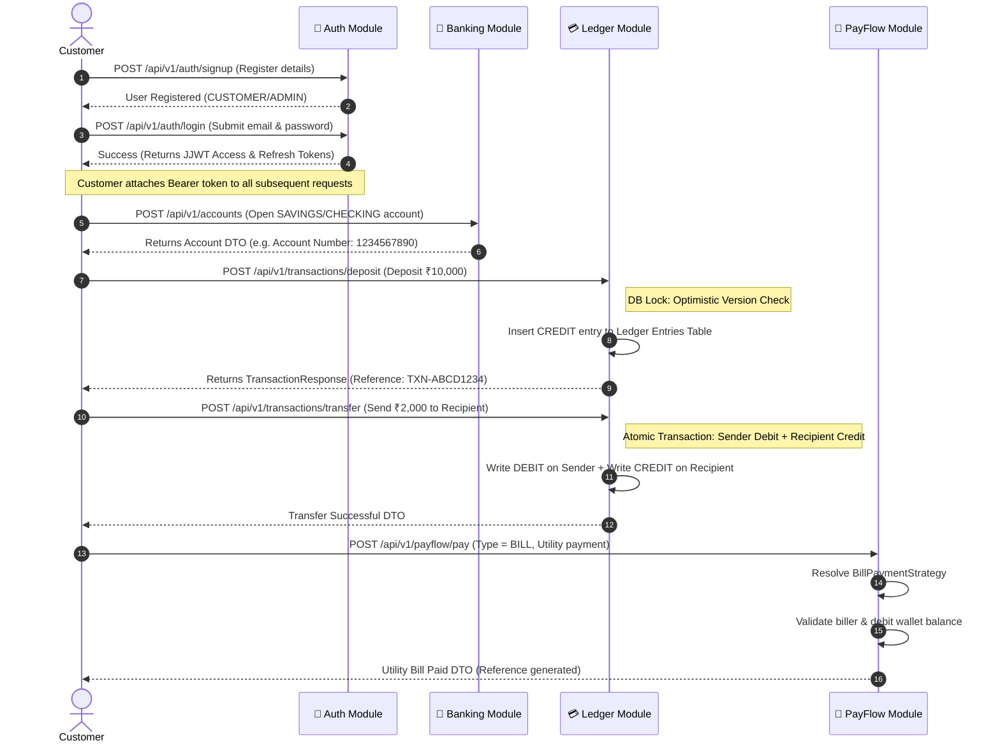

# NeoBank Super-App — Chronological API Reference & System Flows

This document details the chronological user journey through the NeoBank Super-App API endpoints, followed by visual architectural flowcharts to showcase exactly how the application functions behind the scenes.

---

## 🗺️ System Architecture Flowchart

This Mermaid flowchart visualizes how a customer interacts with NeoBank, how security is enforced, how the core ledger is updated, and how wallet payments route through the dynamic strategy pattern.


---

## 🔄 User Action Flow (Step-by-Step Journeys)

This flowchart illustrates the typical user path from absolute signup to opening accounts, depositing funds, transferring, and using the dynamic strategy wallet system.



---

## 📖 Chronological API Reference

Here is the list of REST APIs in the exact order a client/frontend application calls them to run the super-app:

### 🔐 1. Authentication Layer (Public Endpoints)

#### A. Sign Up / Register
* **Endpoint**: `POST /api/v1/auth/signup`
* **Purpose**: Register a new user in the system.
* **Payload**:
  ```json
  {
    "email": "customer@neobank.com",
    "username": "customer_neobank",
    "password": "Password123!",
    "fullName": "Jane Doe"
  }
  ```
* **Response (201 Created)**:
  ```json
  {
    "success": true,
    "message": "User registered successfully."
  }
  ```

#### B. Log In / Authenticate
* **Endpoint**: `POST /api/v1/auth/login`
* **Purpose**: Authenticate credentials and receive authorization tokens.
* **Payload**:
  ```json
  {
    "email": "customer@neobank.com",
    "password": "Password123!"
  }
  ```
* **Response (200 OK)**:
  ```json
  {
    "success": true,
    "message": "Authentication successful.",
    "data": {
      "accessToken": "eyJhbGciOi...",
      "refreshToken": "d7bca81d...",
      "username": "customer_neobank",
      "email": "customer@neobank.com",
      "role": "CUSTOMER"
    }
  }
  ```

---

### 🏦 2. Account Management Layer (Authenticated: JWT Required)

#### A. Open a New Account
* **Endpoint**: `POST /api/v1/accounts`
* **Purpose**: Create a CHECKING or SAVINGS account with ₹0.00 default balance.
* **Payload**:
  ```json
  {
    "type": "CHECKING"
  }
  ```
* **Response (201 Created)**:
  ```json
  {
    "success": true,
    "message": "Account opened successfully.",
    "data": {
      "id": "acc-uuid-1234",
      "accountNumber": "9816273849",
      "ownerName": "Jane Doe",
      "type": "CHECKING",
      "balance": 0.00,
      "formattedBalance": "₹0.00",
      "status": "ACTIVE",
      "currency": "INR",
      "createdAt": "2026-05-26T23:30:00"
    }
  }
  ```

#### B. List My Accounts
* **Endpoint**: `GET /api/v1/accounts`
* **Purpose**: Fetch all accounts opened by the logged-in customer.
* **Response (200 OK)**:
  ```json
  {
    "success": true,
    "message": "Accounts retrieved.",
    "data": [
      {
        "id": "acc-uuid-1234",
        "accountNumber": "9816273849",
        "ownerName": "Jane Doe",
        "type": "CHECKING",
        "balance": 0.00,
        "formattedBalance": "₹0.00",
        "status": "ACTIVE",
        "createdAt": "2026-05-26T23:30:00"
      }
    ]
  }
  ```

---

### 💳 3. Core Transactions & Ledger Layer (Authenticated)

#### A. Deposit Funds
* **Endpoint**: `POST /api/v1/transactions/deposit`
* **Purpose**: Credit cash into an account (e.g. simulation of cash deposit/UPI load).
* **Headers**: `X-Idempotency-Key` or payload-based `idempotencyKey`.
* **Payload**:
  ```json
  {
    "accountId": "acc-uuid-1234",
    "amount": 10000.00,
    "description": "Initial account deposit",
    "idempotencyKey": "dep-idem-key-001"
  }
  ```
* **Response (200 OK)**:
  ```json
  {
    "success": true,
    "message": "Deposit processed successfully.",
    "data": {
      "id": "txn-uuid-8888",
      "fromAccountNumber": "External",
      "fromOwnerName": "N/A",
      "toAccountNumber": "9816273849",
      "toOwnerName": "Jane Doe",
      "amount": 10000.00,
      "formattedAmount": "₹10,000.00",
      "type": "DEPOSIT",
      "status": "SUCCESS",
      "reference": "TXN-E7C1F2B3A499",
      "description": "Initial account deposit",
      "createdAt": "2026-05-26T23:35:10"
    }
  }
  ```

#### B. Withdraw Funds
* **Endpoint**: `POST /api/v1/transactions/withdraw`
* **Purpose**: Debit cash from an account. Enforces balance check & user ownership.
* **Payload**:
  ```json
  {
    "accountId": "acc-uuid-1234",
    "amount": 1500.00,
    "description": "ATM cash withdrawal",
    "idempotencyKey": "with-idem-key-001"
  }
  ```
* **Response (200 OK)**:
  ```json
  {
    "success": true,
    "message": "Withdrawal processed successfully.",
    "data": {
      "id": "txn-uuid-8890",
      "fromAccountNumber": "9816273849",
      "fromOwnerName": "Jane Doe",
      "toAccountNumber": "External",
      "toOwnerName": "N/A",
      "amount": 1500.00,
      "formattedAmount": "₹1,500.00",
      "type": "WITHDRAW",
      "status": "SUCCESS",
      "reference": "TXN-F9D1E8C2B3A1",
      "description": "ATM cash withdrawal",
      "createdAt": "2026-05-26T23:37:45"
    }
  }
  ```

#### C. Peer-to-Peer Transfer
* **Endpoint**: `POST /api/v1/transactions/transfer`
* **Purpose**: Perform an atomic double-entry transfer of money to a recipient's account number.
* **Payload**:
  ```json
  {
    "fromAccountId": "acc-uuid-1234",
    "toAccountNumber": "0987654321",
    "amount": 2500.00,
    "description": "Rent payment",
    "idempotencyKey": "trans-idem-key-001"
  }
  ```
* **Response (200 OK)**:
  ```json
  {
    "success": true,
    "message": "Transfer completed successfully.",
    "data": {
      "id": "txn-uuid-8895",
      "fromAccountNumber": "9816273849",
      "fromOwnerName": "Jane Doe",
      "toAccountNumber": "0987654321",
      "toOwnerName": "Recipient Name",
      "amount": 2500.00,
      "formattedAmount": "₹2,500.00",
      "type": "TRANSFER",
      "status": "SUCCESS",
      "reference": "TXN-A5C9B1E3F7D2",
      "description": "Rent payment",
      "createdAt": "2026-05-26T23:40:02"
    }
  }
  ```

#### D. Fetch Transaction History (Paging)
* **Endpoint**: `GET /api/v1/transactions?page=0&size=10`
* **Purpose**: Fetch all debit/credit transactions for the user, newest first.
* **Response (200 OK)**:
  ```json
  {
    "success": true,
    "message": "Transaction history retrieved successfully.",
    "data": {
      "content": [
        {
          "id": "txn-uuid-8895",
          "fromAccountNumber": "9816273849",
          "fromOwnerName": "Jane Doe",
          "toAccountNumber": "0987654321",
          "toOwnerName": "Recipient Name",
          "amount": 2500.00,
          "formattedAmount": "₹2,500.00",
          "type": "TRANSFER",
          "status": "SUCCESS",
          "reference": "TXN-A5C9B1E3F7D2",
          "description": "Rent payment",
          "createdAt": "2026-05-26T23:40:02"
        }
      ],
      "pageable": { ... },
      "totalElements": 1,
      "totalPages": 1
    }
  }
  ```
